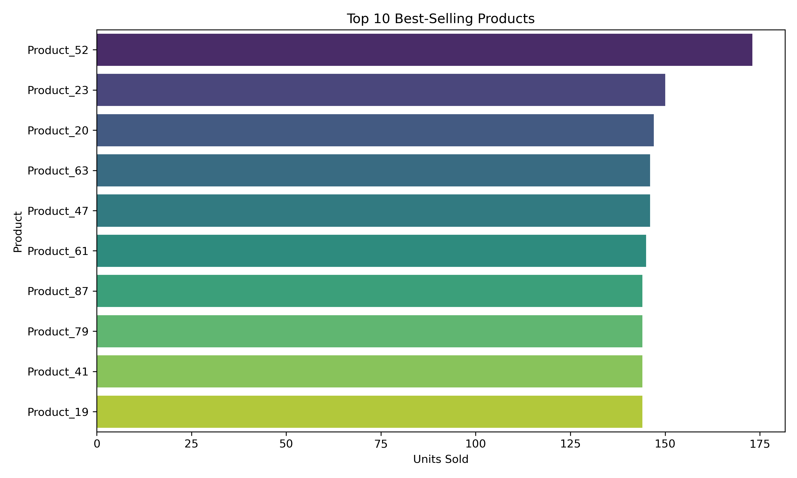

# User Behavior Analysis with SQL and Python

## 1. Project Overview
This project analyzes user behavior and sales data in a simulated e-commerce environment using SQL and Python. We explore user engagement, purchasing patterns, sales trends, and product performance using queries on a relational database.

## 2. Dataset
The dataset consists of four main tables stored in a SQLite file (`user_behavior_analysis.sqlite`):

- `users`: user_id, name, email, created_at
- `orders`: order_id, user_id, order_date
- `order_items`: item_id, order_id, product_id, quantity, unit_price
- `products`: product_id, name, category, price

These tables simulate user registration, purchasing behavior, and product sales.

## 3. Tools
- SQLite for database storage and querying
- Python (Pandas + sqlite3)** for data extraction and manipulation
- Matplotlib & Seaborn for data visualization
- DB Browser for SQLite (for manual exploration, optional)

## 4. Analysis Goals
1. User Activity Analysis
    - Monthly new users
    - Monthly active users
2. Sale Analysis
    - Monthly total sales
    - Total sales per product category
3. User Purchasing Behavior
   - Average number of orders per user
   - Average order value
   - Repurchase rate (users with more than 1 order / total users)
4. Product Performance
    - Top-selling products (by quantity)
    - Worst-selling products
5. High-Value Users
    - Top 10 users by total spending
    - Calculated customer lifetime value

## 5. Visualizations
All charts were generated from the SQLite database using Python and saved in the `plots/` folder.

| Chart | Description |
|-------|-------------|
|  | Monthly number of newly registered users |
|  | Users who placed orders per month |
|  | Monthly total revenue trend |
|  | Revenue by product category |
|  | Avg. orders per user, order value |
|  | Repurchase rate |
|  | Top 10 products by quantity sold |
|  | Bottom 10 products by quantity sold |
|  | Top 10 users by total spending |
|  | Duration of Registration and Last Purchase |

## 6. Conclusion
This project provides a hands-on experience in combining SQL data analysis with Python visualization techniques to derive meaningful insights from user behavior and sales trends in e-commerce.

## 7. How to Run This Project
1. Make sure you have Python 3, Pandas, matplotlib, and seaborn installed.
2. Place `user_behavior_analysis.sqlite` in the root folder.
3. Run `User_Behaviours_Analysis.ipynb` or execute each Python cell to recreate all queries and visualizations.

## 8. Folder Structure

Project2-imdb-analysis/
├── User_Behaviours_Analysis.ipynb
├── user_behavior_analysis.sqlite
├── 1-monthly-active-users.csv
├── 1-monthly-active-users.sql
├── 1-monthly-new-users.csv
├── 1-monthly-new-users.sql
├── 2-monthly-sales-trend.csv
├── 2-monthly-sales-trend.sql
├── 2-total-sales-by-product-category.csv
├── 2-total-sales-by-product-category.sql
├── 3-average-spending-amount.csv
├── 3-average-spending-amount.sql
├── 3-average-user-orders.csv
├── 3-average-user-orders.sql
├── 3-repurchase-rate.csv
├── 3-repurchase-rate.sql
├── 4-bottom-sale-product.csv
├── 4-bottom-sale-product.sql
├── 4-top-sale-product.csv
├── 4-top-sale-product.sql
├── 5-top-spending.csv
├── 5-top-spending.sql
├── 5-user-lifetime.csv
├── 5-user-lifetime.sql
├── README.md
├── plots/
├───── category_sales.png
├───── ltv_distribution.png
├───── monthly_active_users.png
├───── monthly_new_users.png
├───── monthly_sales.png
├───── repurchase_rate.png
├───── top_products.png
├───── top_users.png
├───── user_behavior.png
└───── worst_products.png